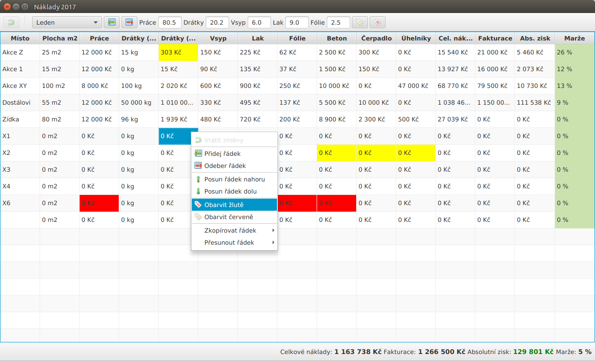

# Costs

Simple [JavaFX](https://www.java.com/) application for calculating costs for one building company (used version of Java is __11__). As a storage is used simple XML file.

## Building

Use [IntelliJ IDEA Community Edition](https://www.jetbrains.com/idea/) to build this application.

## Running

Just type in terminal opened in the directory where application's JAR lives:

	java -jar CostsFX.jar

## Screenshot

